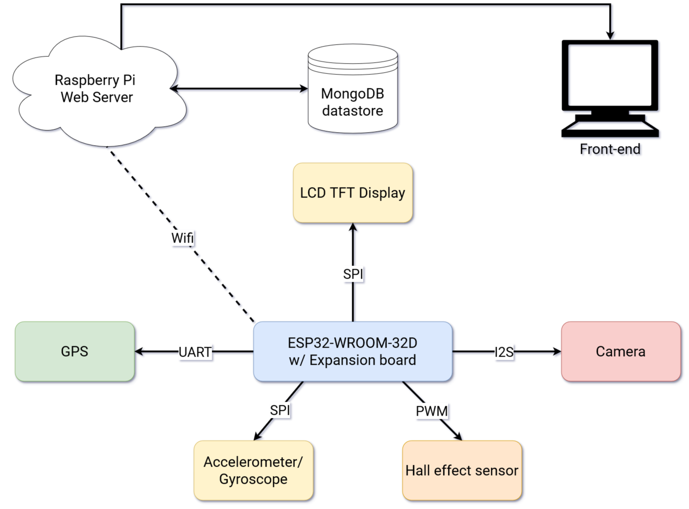

# Bike Infotainment System

## Introducere

Autor: **Robert Grancsa 332CA**

Un infotainment pentru biciclete, vrea să afișeze pe un display informații folositoare despre statusul curent al cursei tale precum:
* Viteza curentă
* Temperatura de afară
* Viteza medie din cursa curentă
* Locația curentă
* Status despre ce obiecte sunt pe traseu, folosind un model de image recognition, care poate identifica semne de circulație.
* Înclinația și acceleratia curentă

Pe lângă asta, dispozitivul este conectat la internet, și comunică mereu cu un server pe un Raspberry Pi, unde stochează informațiile, care mai apoi sunt salvate într-o bază de date și afișate într-un dashboard folositor, care îți arată detalii despre ultimele tale curse, cu un istoric cu unde ai fost și ce locuri ai vizitat.

Acest dispozitiv de infotainment pentru biciclete aduce o serie de beneficii semnificative pentru cicliști, oferindu-le uneltele necesare pentru a monitoriza și îmbunătăți experiența lor de ciclism.

## Descriere generală

Schema proiectului este compusă dintr-un microcontroller ESP32, care conectează partea fizică a proiectului. Conectat la el, putem găsi:
1. GPS - ne va întoarce date despre locația curentă printr-un stream pe UART, aceste date fiind stocate și trimise mai departe la server o dată la câteva secunde.
1. Accelerometru - ne poate afișa starea curentă a bicicletei, dacă se apleacă stânga sau dreapta, sau cât de repede accelerează sau frânează.
1. Hall Effect senzor - folosit pentru a calcula numărul de revoluții pe secundă al bicicletei, pentru a afișa o estimare corectă a vitezei.
1. Camera - va transmite cadre o dată pe secundă către server, care mai apoi va întoarce date despre cadrul curent, mai apoi fiind afișat pe display.
1. Display - aici vor fi afișate toate datele importante, care nu sunt transmise către server dar care ajută la a vedea mai ușor starea curentă.
1. Serverul Raspberry Pi - face conexiunea cu toate instrumentele de la bord, care le stochează pe o bază de date locală, și după le putem interoga pe un front-end cu un dashboard, care ne arată statistici despre ultimele curse.

## Hardware Design

Aici puneți tot ce ține de hardware design:
- listă de piese
- scheme electrice (se pot lua și de pe Internet și din datasheet-uri, e.g. [link](http://www.captain.at/electronic-atmega16-mmc-schematic.png))
- diagrame de semnal
- rezultatele simulării

## Software Design

Descrierea codului aplicației (firmware):
- mediu de dezvoltare (if any) (e.g. AVR Studio, CodeVisionAVR)
- librării și surse 3rd-party (e.g. Procyon AVRlib)
- algoritmi și structuri pe care plănuiți să le implementați
- (etapa 3) surse și funcții implementate

## Rezultate Obținute

Care au fost rezultatele obținute în urma realizării proiectului vostru.

## Concluzii

## Download

O arhivă (sau mai multe dacă este cazul) cu fișierele obținute în urma realizării proiectului: surse, scheme, etc. Un fișier README, un ChangeLog, un script de compilare și copiere automată pe uC crează întotdeauna o impresie bună ;-).

Fișierele se încarcă pe wiki folosind facilitatea **Add Images or other files**. Namespace-ul în care se încarcă fișierele este de tipul **:pm:prj20??:c?** sau **:pm:prj20??:c?:nume_student** (dacă este cazul).

## Jurnal

Puteți avea și o secțiune de jurnal în care să poată urmări asistentul de proiect progresul proiectului.

## Bibliografie/Resurse

Listă cu documente, datasheet-uri, resurse Internet folosite, eventual grupate pe **Resurse Software** și **Resurse Hardware**.
